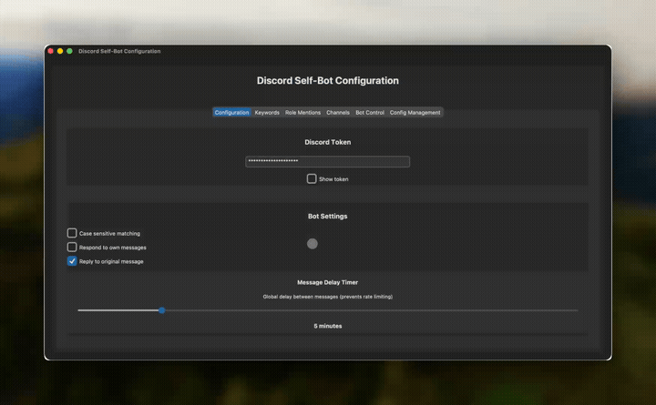
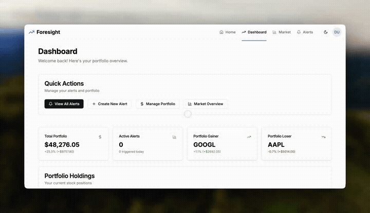

# Hi, I'm Salim Mohamed 👋

## 🎓 About Me

**Computer Science Senior** @ **Oregon State University** | Background in **AI, Cybersecurity & Accounting**

I build tools that solve real problems — from AI agents that detect insider trading to full-stack platforms with real-time data. Passionate about **AI/ML**, **full-stack development**, and **systems programming**.

## 🏆 Achievements

### 🥇 ColorStack Winter Hackathon 2025 — Best Overall Project

**Project**: [Argus](https://github.com/salimmohamed/colorstackwinterhack2025-argus) | [Live Demo](https://argus-watch.vercel.app)

> **🏆 Awarded Best Overall Project** at the ColorStack Winter Hackathon 2025.

An AI-powered agent that autonomously monitors **Polymarket** prediction markets for insider trading activity. Uses **Claude Opus 4.5** to detect suspicious trader behavior — flagging accounts with unusual win rates, disproportionate bets, and suspicious timing around announcements.

**What I Built**:
- **AI Analysis Engine**: Integrated Claude Opus 4.5 via AWS Bedrock to analyze trader patterns and generate evidence-based insider trading reports
- **Real-Time Market Monitoring**: Built ingestion pipeline for Polymarket API to track live prediction market activity
- **Full-Stack Platform**: Next.js 15 + React 19 frontend with Convex serverless backend
- **Pattern Detection**: Automated flagging system for anomalous trading behavior across market events

**Technologies**: Next.js, React, TypeScript, Claude Opus 4.5, AWS Bedrock, Convex, Tailwind CSS

---

## 💻 Tech Stack

### Languages

### AI & Machine Learning

### Frontend

### Backend & Databases

### Tools & Infrastructure

---

## 📊 Featured Projects

### 🤖 [Discord Auto-Responder Bot](https://github.com/salimmohamed/Discord-Auto-Responder-Bot) — Automated Discord Bot
> **60+ Daily Active Users** | Solo Project

An automated Discord responder with a **Tkinter GUI** serving **60+ daily users** — keyword detection, role ping monitoring, and instant custom replies across channels.

**Key Features**:
- Keyword and role mention detection with custom responses
- Channel filtering and restriction controls
- GUI for configuration — no code editing required
- Live logging and start/stop controls

**Technologies**: Python, discord.py, Tkinter, JSON

---

### 📈 [Foresight](https://github.com/salimmohamed/Foresight) — Real-Time Stock Portfolio Platform
> **Full-Stack Finance App** | Solo Project | [Live Demo](https://foresight-wealth.vercel.app)

Real-time stock monitoring platform with portfolio tracking, smart alerts, and market insights.

**Key Features**:
- Real-time stock prices with portfolio performance dashboards
- Smart price-based and percentage-based alerts
- Market leaders, gainers, and losers tracking
- Secure user authentication via Supabase Auth

**Technologies**: Next.js 14, TypeScript, Flask, Supabase, Alpha Vantage API, Tailwind CSS

---

### 🔍 [Job Application Tool](https://github.com/salimmohamed/CS46X-Job-Application-Tool) — AI Job Matching Platform
> **Senior Capstone** | Team of 4

AI-powered web application that scrapes job boards (LinkedIn, Indeed, GitHub Jobs) and uses ML-based matching to connect job seekers with relevant opportunities.

**Key Features**:
- Multi-source web scraping with Selenium (LinkedIn, Indeed, GitHub Jobs)
- ML-powered job matching via LangChain/LangGraph
- React + TypeScript frontend with Python backend
- CI/CD pipeline with GitHub Actions and Docker

**Technologies**: React, TypeScript, Python, LangChain, Selenium, Docker, GitHub Actions

---

## 🔭 Currently Working On

- 🥇 **Argus**: Expanding AI-powered market monitoring with new detection models
- 🧪 **Senior Capstone**: AI-driven job application tool with ML matching

## 🌱 Currently Learning

- Advanced AI agent architectures and Claude Opus 4.5 integration
- Cloud deployment and serverless architectures (AWS, Cloudflare Workers)
- Systems programming and low-level optimization

## 📫 How to Reach Me

- **Email**: [mohamsal@oregonstate.edu](mailto:mohamsal@oregonstate.edu)
- **LinkedIn**: [linkedin.com/in/salimamohamed](https://linkedin.com/in/salimamohamed)
- **Portfolio**: [salimmohamed.dev](https://salimmohamed.dev)

## 💼 Open to Opportunities

I'm actively seeking **full-time roles and internships** in:
- **AI/ML Engineering**
- **Full-Stack Development**
- **Backend Engineering (Python/TypeScript/Go)**
- **Systems Programming**

---

⭐️ Oregon State University CS '26
