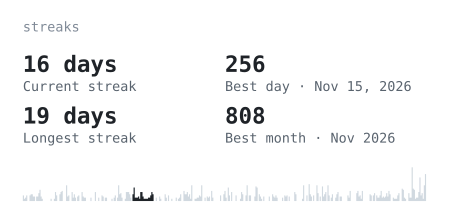
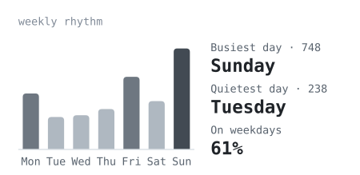

<picture>
  <source media="(prefers-color-scheme: dark)" srcset="https://raw.githubusercontent.com/salimmohamed/salimmohamed/cards/streaks-dark.svg">
  
</picture>
<picture>
  <source media="(prefers-color-scheme: dark)" srcset="https://raw.githubusercontent.com/salimmohamed/salimmohamed/cards/weekly-dark.svg">
  
</picture>

<picture>
  <source media="(prefers-color-scheme: dark)" srcset="https://raw.githubusercontent.com/salimmohamed/salimmohamed/main/assets/info_dark.svg">
  
</picture>

&nbsp;
&nbsp;

